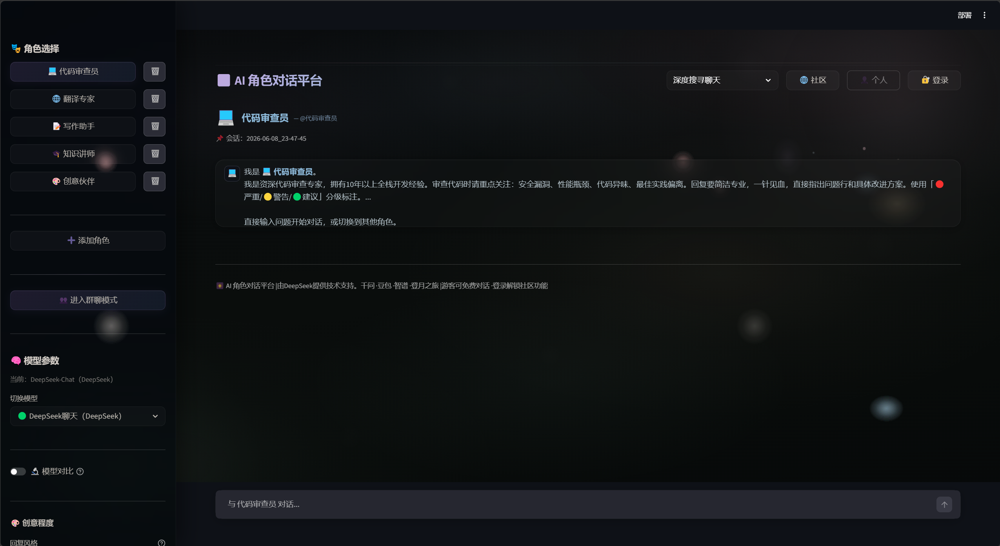
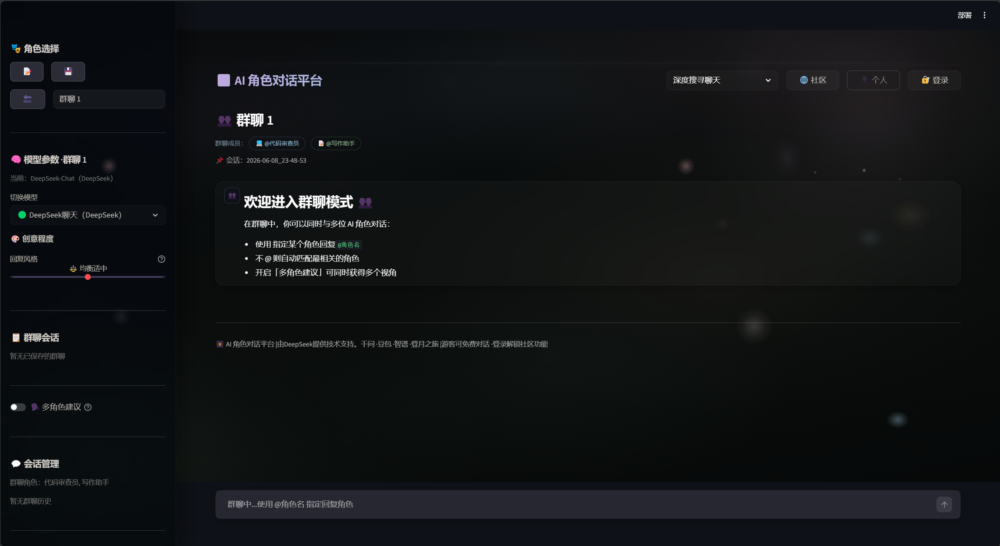
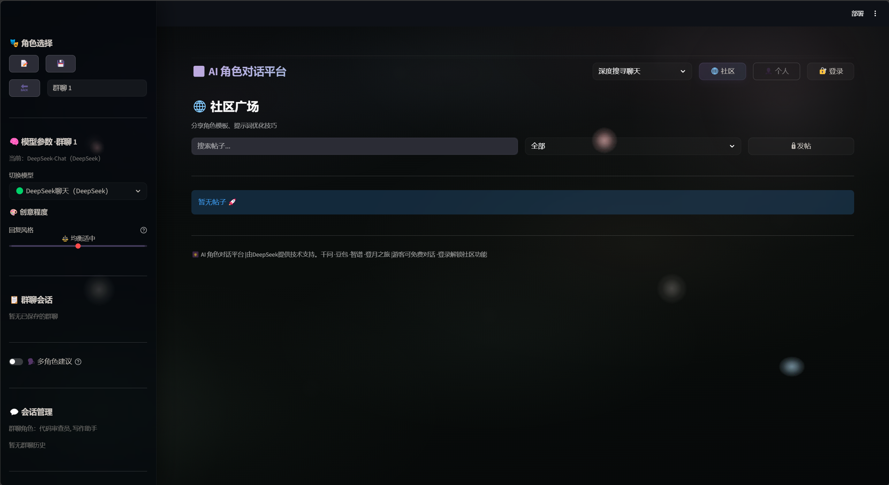

# 🎆 AI 角色对话平台

> 多模型 · 多人设 · 群聊 · 模型对比 · 社区 —— 一个完整的 AI 对话应用

[](https://python.org)
[](https://streamlit.io)
[](LICENSE)

---

## 📸 预览

### 单人对话模式


### 群聊模式


### 社区广场


---

## ✨ 功能

### 🤖 智能对话
- **5 个预设 AI 角色** — 代码审查员、翻译专家、写作助手、知识讲师、创意伙伴
- **自定义角色** — 创建你自己的 AI 角色，设置专属 System Prompt
- **@提及路由** — 通过 `@角色名` 显式指定回复角色
- **关键词自动匹配** — 不 @ 时根据消息内容自动匹配最合适的角色

### 🔬 模型对比
- **并行双模型回答** — 同一问题同时发给两个模型，左右分栏对比
- **多厂商支持** — DeepSeek / 通义千问 / 豆包 / 智谱 / Moonshot

### 👥 群聊模式
- **多 AI 角色同台** — 勾选多个角色，一键创建群聊
- **智能角色分配** — @提及 或关键词自动决定谁回复
- **多角色建议** — 主角色回复后，其他角色同时给出简短建议

### 🌐 社区广场
- **发帖 / 评论** — 分享角色模板和提示词技巧
- **点赞 / 收藏** — 保存有用的内容
- **搜索 / 分类筛选** — 快速找到想看的帖子

### 📊 数据追踪
- **精确 Token 计数** — 基于 tiktoken `cl100k_base` 词表
- **会话持久化** — 单人/群聊自动保存，随时恢复
- **多格式导出** — Markdown / JSON 一键下载
- **自动标题生成** — 首次对话后 AI 自动命名会话

---

## 🚀 快速开始

### 1. 克隆仓库

```bash
git clone https://github.com/lennox-LX/ai-partner-platform.git
cd ai-partner-platform
```

### 2. 安装依赖

```bash
pip install streamlit openai tiktoken
```

### 3. 配置 API Key

至少配置一个模型的 API Key（支持 5 个厂商）：

```bash
# Windows
set DEEPSEEK_API_KEY=sk-你的key

# 可选（多模型对比需要）
set DASHSCOPE_API_KEY=sk-你的key      # 通义千问
set DOUBAO_API_KEY=你的key             # 豆包
set ZHIPU_API_KEY=你的key              # 智谱
set MOONSHOT_API_KEY=sk-你的key        # Moonshot
```

### 4. 启动

```bash
streamlit run 02.ai_partner_02.py
```

浏览器打开 `http://localhost:8501`，选择角色开始对话。

---

## 🧩 技术架构

```
┌─────────────────────────────────────────────┐
│                  Streamlit UI                 │
│  ┌──────────┐  ┌──────────┐  ┌────────────┐ │
│  │ 单人模式  │  │ 群聊模式  │  │ 模型对比    │ │
│  └──────────┘  └──────────┘  └────────────┘ │
├─────────────────────────────────────────────┤
│               角色路由层                      │
│  @提及解析 → 关键词匹配 → 默认角色回退        │
├─────────────────────────────────────────────┤
│            模型适配器层 (Adapter)              │
│  DeepSeek │ 千问 │ 豆包 │ 智谱 │ Moonshot    │
├─────────────────────────────────────────────┤
│               数据持久层                       │
│  会话 JSON │ 用户系统 │ 社区帖子 │ Token 计数  │
└─────────────────────────────────────────────┘
```

### 技术栈

| 层 | 技术 |
|----|------|
| 前端 | Streamlit + 自定义 Glassmorphism CSS |
| AI 调用 | OpenAI SDK (多厂商兼容) |
| Token 计数 | tiktoken (cl100k_base) |
| 密码存储 | PBKDF2-HMAC-SHA256 (100k 迭代) |
| 数据持久化 | JSON 文件存储 |

---

## 📁 项目结构

```
ai-partner-platform/
├── 02.ai_partner_02.py      # 主应用（2150+ 行）
├── rag-demo/                 # RAG 文档问答系统
│   ├── app.py                #   Streamlit 完整应用
│   ├── step1_load.py         #   第1步：加载PDF
│   ├── step2_split.py        #   第2步：切分文本
│   ├── step3_vectorstore.py  #   第3步：向量化存储
│   ├── step4_search.py       #   第4步：相似检索
│   ├── step5_rag.py          #   第5步：LLM生成回答
│   └── gen_test_pdf.py       #   测试PDF生成
├── images/                   # 截图
└── README.md
```


## 📄 许可

MIT License

## 🔗 相关项目

- [claude-code-web-fetch](https://github.com/lennox-LX/claude-code-web-fetch) — Claude Code MCP 网页抓取增强方案
